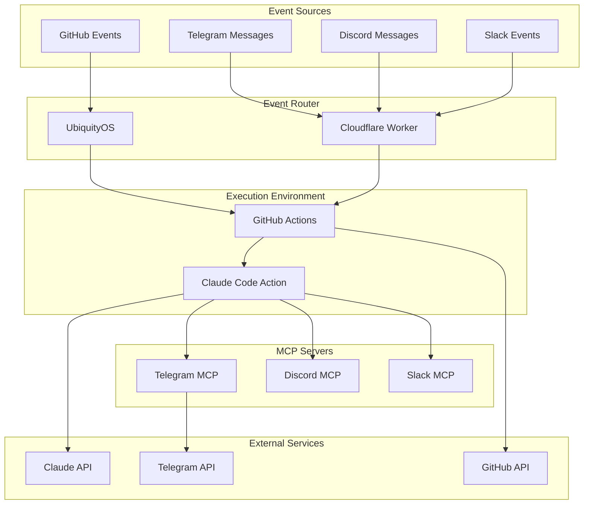

# System Architecture

## Overview

The Personal Agent is a distributed automation platform that integrates with multiple services through a modular architecture.



## Core Components

### 1. Event Router Layer

**UbiquityOS**
- Captures GitHub events (issues, PRs, comments)
- Routes events based on username mentions
- Forwards to appropriate agent instances

**Cloudflare Worker**
- Handles webhooks from external platforms
- Validates and normalizes event data
- Routes to GitHub Actions for processing

### 2. Execution Environment

**GitHub Actions**
- Provides compute resources
- Offers full shell access
- Manages secrets and credentials
- Executes Claude Code Action

**Claude Code Action**
- Core AI processing engine
- Interprets natural language commands
- Executes shell commands
- Integrates with MCP servers

### 3. Model Context Protocol (MCP) Layer

**MCP Servers**
- Platform-specific integrations
- Handle API authentication
- Provide tool definitions
- Execute platform operations

### 4. Event Context Structure

```typescript
interface EventContext {
  platform: string;              // Platform identifier
  eventType: string;            // Event classification
  source?: string;              // Event source identifier
  repository?: string;          // GitHub repository
  issueNumber?: string;         // Issue/PR number
  author: string;               // Event author
  command: string;              // User command
  metadata?: {                  // Platform-specific data
    chatId?: string;
    messageId?: string;
    channelId?: string;
    [key: string]: any;
  };
}
```

## Data Flow

### 1. Event Capture
```
User Action → Platform → Webhook → Router → GitHub Actions
```

### 2. Command Processing
```
GitHub Actions → Claude Code Action → Claude API → Response
```

### 3. Action Execution
```
Claude Response → MCP Server → Platform API → User Feedback
```

## Security Architecture

### Authentication Layers

1. **Platform Authentication**
   - OAuth tokens for API access
   - Webhook secrets for validation
   - API keys for services

2. **Access Control**
   - PAT-based permissions
   - Read-only vs full access modes
   - User-specific agent instances

3. **Environment Isolation**
   - Separate GitHub Actions runners
   - Isolated credential stores
   - Sandboxed execution contexts

### Security Boundaries

```
┌─────────────────────────────────────┐
│         Public Internet             │
├─────────────────────────────────────┤
│      Webhook Validation Layer       │
├─────────────────────────────────────┤
│        Event Router (CDN)           │
├─────────────────────────────────────┤
│     GitHub Actions (Isolated)       │
├─────────────────────────────────────┤
│    Claude Code Action (Sandboxed)   │
├─────────────────────────────────────┤
│      MCP Servers (Authenticated)    │
└─────────────────────────────────────┘
```

## Scaling Architecture

### Horizontal Scaling
- Multiple GitHub Actions runners
- Distributed Cloudflare Workers
- Load-balanced MCP servers

### Vertical Scaling
- Configurable runner sizes
- Adjustable timeout limits
- Resource allocation per task

## Platform Integration Patterns

### GitHub Integration
```typescript
// Direct API integration
class GitHubPlatform {
  async handleEvent(context: EventContext) {
    // Validate GitHub event
    // Execute via GitHub API
    // Return formatted response
  }
}
```

### Telegram Integration
```typescript
// MCP-based integration
class TelegramPlatform {
  async handleEvent(context: EventContext) {
    // Route to Telegram MCP
    // Execute via Bot API
    // Format MarkdownV2 response
  }
}
```

## Extension Points

### Adding New Platforms

1. **Create Platform Adapter**
   ```typescript
   interface PlatformAdapter {
     validateEvent(event: any): boolean;
     normalizeEvent(event: any): EventContext;
     formatResponse(response: string): any;
   }
   ```

2. **Implement MCP Server**
   ```typescript
   class NewPlatformMCP {
     tools: Tool[];
     async execute(tool: string, args: any): Promise<any>;
   }
   ```

3. **Register in Platform Registry**
   ```typescript
   registry.register('new-platform', {
     adapter: NewPlatformAdapter,
     mcp: NewPlatformMCP,
     credentials: ['API_KEY', 'API_SECRET']
   });
   ```

## Performance Considerations

### Caching Strategy
- Response caching at CDN level
- MCP tool result caching
- Credential caching in memory

### Optimization Points
- Lazy loading of MCP servers
- Parallel API calls where possible
- Connection pooling for APIs

## Monitoring Architecture

### Metrics Collection
```typescript
interface Metrics {
  requestCount: Counter;
  responseTime: Histogram;
  errorRate: Gauge;
  activeSessions: Gauge;
}
```

### Logging Strategy
- Structured JSON logging
- Correlation IDs for tracing
- Platform-specific log streams

### Alert Conditions
- High error rates (>5%)
- Slow response times (>5s)
- Authentication failures
- Rate limit warnings

## Disaster Recovery

### Backup Strategy
- Configuration backups
- Credential rotation plans
- Fallback execution paths

### Failure Modes
1. **Claude API Unavailable**
   - Fallback to error message
   - Queue for retry
   - Alert administrators

2. **GitHub Actions Down**
   - Route to backup runners
   - Use self-hosted runners
   - Degrade gracefully

3. **Platform API Issues**
   - Retry with backoff
   - Use cached responses
   - Notify user of issues